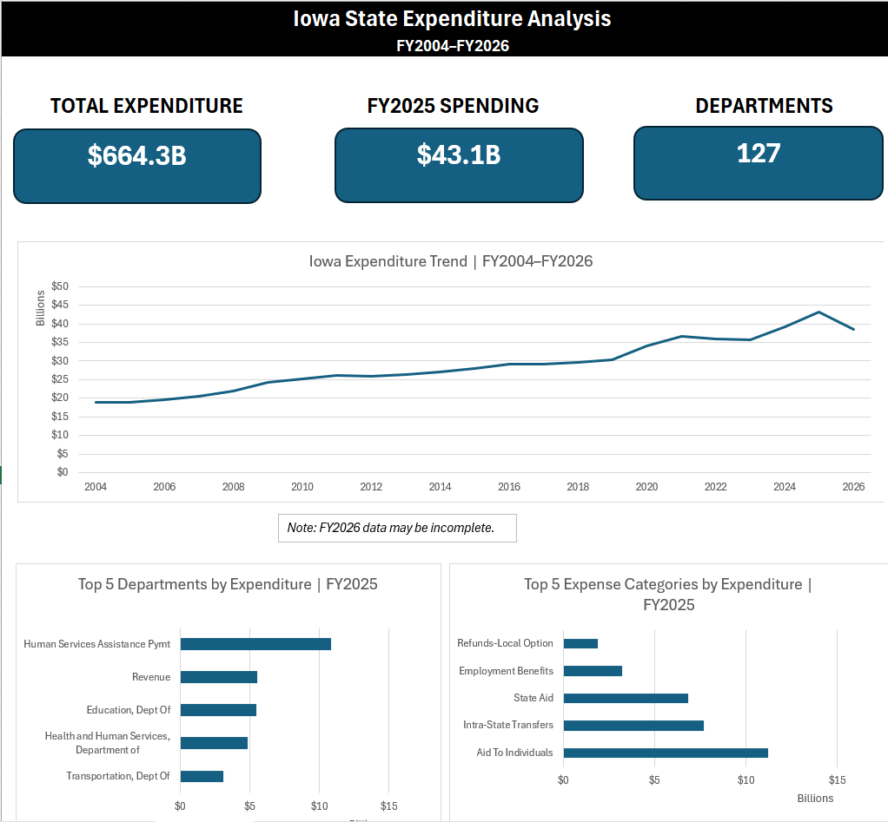

# Iowa State Expenditure Analysis

An Excel-based analysis of more than **4.1 million Iowa State expenditure records** using Power Query, the Excel Data Model, PivotTables, PivotCharts, and advanced Excel formulas.

## Project Overview

This project analyzes Iowa State government expenditure data across multiple fiscal years to identify spending trends, major departments, expense categories, and year-over-year changes.

The dataset contains more than **4.1 million rows**, requiring Power Query and the Excel Data Model to efficiently clean, organize, and analyze the data beyond a standard Excel worksheet workflow.

## Tools Used

- Microsoft Excel
- Power Query
- Excel Data Model
- PivotTables
- PivotCharts
- XLOOKUP
- SUMIFS
- INDEX/MATCH

## Analysis

The dashboard explores:

- Total state expenditure
- Spending trends by fiscal year
- Year-over-year spending changes
- Department spending
- Top expense categories
- Highest-spending departments
- FY2026 expenditure activity

## Dashboard

## Data Preparation

The raw expenditure data was:

1. Imported and combined using Power Query
2. Cleaned and standardized
3. Loaded into the Excel Data Model
4. Analyzed using PivotTables and Excel formulas
5. Presented through an interactive dashboard

## Note

FY2026 data may be incomplete.
